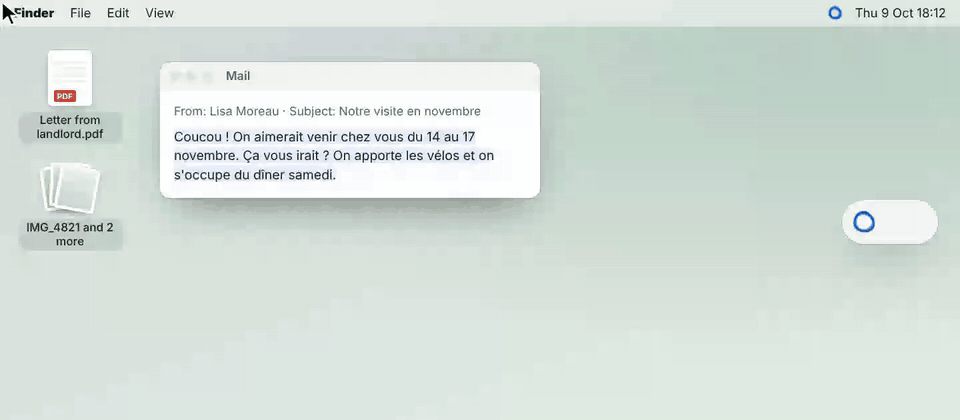
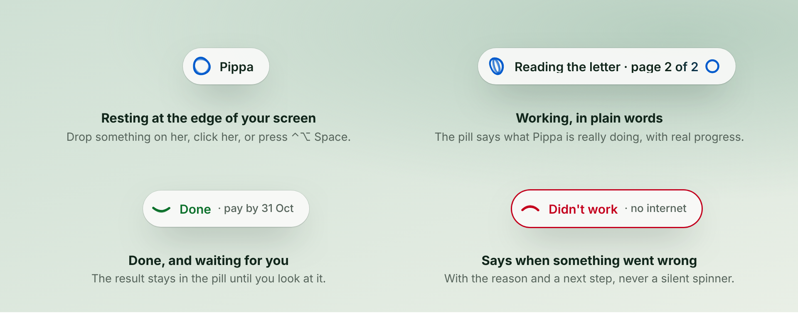
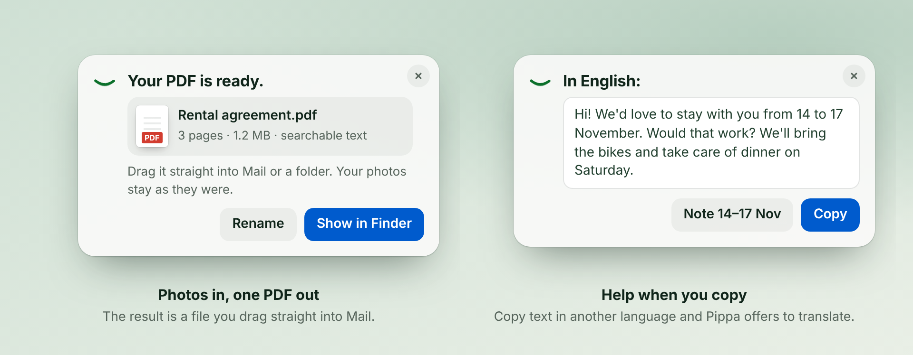

<p align="center">
  
</p>

<h1 align="center">Pippa</h1>

<p align="center">
  <b>Just drop it on Pippa.</b><br>
  A small helper at the edge of your Mac's screen. Give her a letter, a few photos or a messy folder,<br>
  pick one of the next steps she offers, and get the result right in the pill. The AI runs on your Mac.
</p>

<p align="center">
  <a href="https://github.com/tschnorpfeil/pippa/releases/latest/download/Pippa.dmg"><b>Download for Mac</b></a> ·
  <a href="https://heypippa.app">heypippa.app</a> ·
  free and open source (MIT)
</p>

<p align="center">
  <picture>
    <source media="(prefers-color-scheme: dark)" srcset="docs/images/pippa-demo-dark.gif">
    
  </picture>
</p>

## Why Pippa

Most AI apps start with an empty text box and expect you to know what to ask. Pippa starts with your stuff.

- **Drop, don't prompt.** Drag something onto the pill, or click her while a mail or a spreadsheet is open. She offers two or three next steps in plain words. Typing always works too, but you never have to.
- **The pill tells you what's happening.** "Reading the letter · page 2 of 2", not dots that blink. Every job ends in one of three ways: done, needs you, or didn't work, with the reason.
- **The answer comes first.** One sentence that says what to do, the passage it came from, and a button for the next step.
- **Results are things.** A finished PDF sits in the pill and can be dragged straight into Mail. A reply waits in Mail as a draft.
- **It stays until you look.** Close the window, come back later: the result is still in the pill.

<p align="center">
  <picture>
    <source media="(prefers-color-scheme: dark)" srcset="docs/images/pill-moods-dark.png">
    
  </picture>
</p>

Pippa is made for people who don't pay for AI subscriptions and never open Terminal. She speaks English, and German when your Mac is set to German, and answers in the language you write in.

## What she can do

- **Understand a letter or a PDF.** What does it say, what do I need to do, by when? Amounts and dates come with the passage they were taken from.
- **Answer an email.** Select a mail in Apple Mail and call Pippa (click her or press **⌃⌥ Space**). She can check your calendar and put a reply into Mail as a draft. Pippa never sends mail; you do.
- **Calendar and reminders.** Add an appointment or a reminder, for example a payment deadline from a letter.
- **Photos to PDF.** Drop scans or phone photos and choose *Make one PDF* (with searchable text), *Make smaller*, or convert between PDF, JPG and PNG. This runs on your Mac without a model, and your originals stay as they are.
- **Tidy a folder.** Ask her to tidy Downloads; she sorts files into folders and shows you what went where.
- **Check a spreadsheet.** Select cells in Microsoft Excel and choose *Check the total*: the numbers are added up again in code, and rows the total leaves out are pointed out. She can also collect invoices from a folder into a table.
- **Find a file.** "Where is the invoice from the plumber?" searches your Mac with Spotlight.
- **Look something up online,** when the answer isn't on your Mac.

Because the brain behind the pill is a real agent with real tools, Pippa can also handle jobs nobody planned for, such as renaming a batch of files.

<p align="center">
  <picture>
    <source media="(prefers-color-scheme: dark)" srcset="docs/images/pill-moments-dark.png">
    
  </picture>
</p>

<sub>The pictures are renderings of the pill design Pippa is moving to, made from [`docs/images/src`](docs/images/src). Examples and names are made up.</sub>

## How it works

Pippa is a thin, friendly layer over proven open-source parts. The app is the pill; everything clever is [Pi](https://github.com/earendil-works/pi).

```
Pippa.app (Swift, SwiftUI)          the pill, cards, settings, first start
 ├─ llama-server (llama.cpp)        the local AI, on 127.0.0.1 only
 ├─ pi --mode rpc                   the agent that does the work
 │   ├─ Pippa's skills              letter, reply, tidy, find a file, ...
 │   ├─ Pi packages                 file tools, pi-web-access for the web
 │   └─ MCP client ───────────────► Pippa's MCP server (inside the app)
 │                                  Mail, Calendar, Reminders, Excel, documents
 └─ optional: your ChatGPT subscription through Pi's own sign-in
```

- **Pi is the brain.** Pippa installs a pinned Pi release for you, without Terminal, and talks to it over `pi --mode rpc`. Everything Pippa knows how to do is a Pi skill in [`runtime/pippa-skills`](runtime/pippa-skills) or a Pi package, so new abilities are text files and packages, not app code. Pi's own updates arrive with Pippa's.
- **Local AI through llama.cpp.** Pippa picks a model that fits your Mac, downloads it once after you agree, and runs it with a bundled, pinned [llama.cpp](https://github.com/ggml-org/llama.cpp). After that she works offline.
- **The web through [pi-web-access](https://github.com/nicobailon/pi-web-access),** the Pi package for search and reading pages.
- **Your Mac's apps through MCP.** Mail, Calendar, Reminders and Excel need the app's macOS permissions, so the app itself serves them to Pi over the Model Context Protocol on 127.0.0.1.
- **Online models are optional.** If you have a ChatGPT subscription, you can sign in through Pi and use it instead of the local model.

## Privacy

- **The AI runs on your Mac.** No Pippa account, no Pippa server, no usage statistics. Pi's telemetry and update checks are switched off for the Pi that Pippa starts.
- **Pippa reads only when you call her,** and then what you yourself can open: files, the selected mail, your calendar.
- **The network is used for** the one-time model download (Hugging Face), app updates (Sparkle, from GitHub releases), web lookups, and an online model if you connect one.
- **Mail is only ever drafted.** Pippa has no tool to send it.

Worth knowing: like Pi, Pippa just does the job instead of asking before every step, and she runs without the macOS App Sandbox because a sandboxed app cannot set up Pi. Keep Time Machine on, as you would anyway.

## Requirements

- A Mac with Apple silicon (M1 or later) and macOS 15 or later
- About 3 to 6 GB of free disk space for the model

| Memory | Model Pippa picks | Download |
|---|---|---|
| 8 GB | Qwen3.5 4B | about 2.7 GB |
| 16 GB or more (recommended) | K2 Horizon 7B | about 5.6 GB |
| 24 GB or more, *More thorough* in Settings | Qwen3.6 35B-A3B | about 13.7 GB |

If a matching model is already on your Mac (LM Studio, Ollama, Hugging Face cache), Pippa reuses it and leaves the original untouched.

## Install

1. Download [Pippa.dmg](https://github.com/tschnorpfeil/pippa/releases/latest/download/Pippa.dmg).
2. Drag Pippa into Applications and open her.
3. Answer one question: may she download her AI now? Everything else sets itself up.

Pi lands in its standard place (`~/.pi/agent`, plus `~/.local/bin/pi` if you have no Pi yet), so the same Pi and the same local model also work from Terminal. An existing Pi install is left alone. Updates arrive automatically.

## Building from source

You need Apple silicon, macOS 15 or later, the Command Line Tools with Swift 6 (`xcode-select --install`) and `cmake` (`brew install cmake`). The first build downloads the pinned llama.cpp source, Node.js and Pi's locked dependencies, all checksum-verified.

```sh
scripts/build-app.sh      # dist/Pippa.app (ad-hoc signed without PIPPA_SIGN_IDENTITY)
scripts/verify-app.sh     # signature, entitlements, bundled Pi, runtime probe
scripts/make-dmg.sh       # dist/Pippa.dmg
```

Checks that need no model:

```sh
swift run --package-path app PippaChecks    # native checks
python3 scripts/check-strings.py            # every UI text in English and German
```

Signing, notarizing, environment variables and where Pippa keeps its data: [docs/development.md](docs/development.md). How to move to a new Pi release: [docs/updating-pi.md](docs/updating-pi.md).

| Path | Contents |
|---|---|
| `app/Sources/Pippa` | the macOS app: pill, cards, settings, first start, updates |
| `app/Sources/PippaCore` | models, llama-server, Pi installer, MCP server, Mail/Calendar/Excel readers, scan tools |
| `app/Sources/PiRPC` | client for `pi --mode rpc` |
| `app/Packaging` | Info.plist, entitlements, pinned llama.cpp, Node and Pi releases |
| `runtime/` | Pippa's Pi skills and packages |
| `scripts/` | build, verify, DMG, release and check scripts |
| `site/` | [heypippa.app](https://heypippa.app) |

## Credits

Pippa stands on the shoulders of:

- [Pi](https://github.com/earendil-works/pi) by Mario Zechner and Earendil Works (MIT), the agent that does the work
- [llama.cpp](https://github.com/ggml-org/llama.cpp) by the ggml authors (MIT), which runs the local model
- [pi-web-access](https://github.com/nicobailon/pi-web-access) by Nico Bailon (MIT), for web search and reading pages
- [Node.js](https://nodejs.org) (MIT and others), which runs Pi
- [Sparkle](https://sparkle-project.org) (MIT), for updates
- [Bagel Fat One](https://fonts.google.com/specimen/Bagel+Fat+One) and [Gochi Hand](https://fonts.google.com/specimen/Gochi+Hand) (SIL Open Font License 1.1)
- the open models [K2 Horizon](https://huggingface.co/IFM/K2-Horizon-7B) by MBZUAI and IFM (Apache 2.0) and [Qwen](https://huggingface.co/Qwen) (Apache 2.0), downloaded from Hugging Face on your Mac and not part of this repository

Licence texts and the full list of bundled components: [THIRD_PARTY_NOTICES.md](THIRD_PARTY_NOTICES.md).

## License

[MIT](LICENSE). Contributions welcome, see [CONTRIBUTING.md](CONTRIBUTING.md).

Pippa is an independent project and is not affiliated with Apple, Microsoft, OpenAI, Google, Alibaba Cloud or Earendil Works. Mac and macOS are trademarks of Apple Inc. Microsoft Excel is a trademark of Microsoft Corporation. ChatGPT is a trademark of OpenAI.
