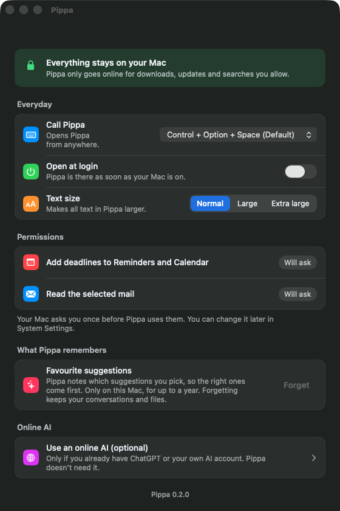
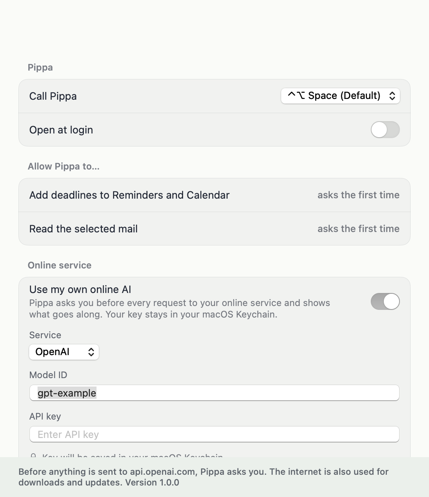

# Settings simplification

Product decision: there is no free local model choice. The model is fixed per system; the one exception is "Pippa's
knowledge: Standard / More thorough" on Macs with 24 GB or more. The settings are cut down radically, because the
audience is non-technical people.

Rule used for every surface: keep only what a non-technical person would truly miss. Duplicates of the menu-bar menu,
technical knobs and anything a sensible default covers are gone.

| Default | Own online AI switched on |
|---|---|
|  |  |

Screenshots: `PIPPA_DEMO=1 PIPPA_SNAPSHOT=<dir> PIPPA_SNAPSHOT_ONLY=settings app/.build/debug/Pippa` (demo engine, no
key, nothing leaves the Mac).

## The model is fixed by hardware

One table, `ModelSelector.table(tier:preference:)` in `app/Sources/PippaCore/Models.swift` (used by
`ModelSelector.choose`). Changing it is one line.

| Memory | Standard | More thorough (Settings) | Context |
|---|---|---|---|
| 8 GB | Qwen3.5 4B Q4 | – | 16K |
| 16 GB | Qwen3.5 9B Q4_K_M | – | 16K |
| 24 GB and up | Qwen3.5 9B Q4_K_M | Qwen3.6 35B-A3B IQ3 | 32K |

Qwen3.5 9B replaced K2 Horizon 7B as the standard after a side-by-side test with Pi (same prompt, skills, guard and
server; 30 agentic dialogues per model, file search, tool choice, latency): 17 vs. 16 tasks fully done, 2 vs. 8 runs
with invented facts, no loop vs. one, median 28 s vs. 48 s per task, German rated better blind
(`docs/rebuild/measurements/model-compare/`). One model family for all three rows
means one template and one tool-call parser. K2 stays in the catalog for measurements (`PIPPA_PI_MODEL`).

Qwen3.5 9B (7 GiB) and K2 Horizon 7B (8.5 GiB) do not fit the 8 GB budget (4.8 GiB, `ModelSelector.budgetGiB`). K2 needs llama.cpp b11503 or
later (K2 support, PR #29535). Its template always opens a thinking block and has no `enable_thinking`, so
`--reasoning off` cannot switch thinking off; the catalog passes `reasoning_effort: "low"` (`<ifm|think_faster>`, the
shortest thinking the template offers) for speed, and llama.cpp puts the thoughts into `reasoning_content`, not the answer.

**Every table model must be pinned** (revision, path, size, SHA256 in `catalog.json`). `scripts/pin-model.sh <key> <repo>`
writes the pin from Hugging Face; `scripts/check-default-models.py` (called by `scripts/build-app.sh`) and the PippaChecks
check "Default model is pinned" fail while one is missing. An unpinned table model also makes setup fail on that Mac.

**Pippa's knowledge (24 GB and up).** One picker in Settings: "Standard (fast, 5.7 GB)" / "More thorough (13.7 GB)",
German "Standard (schnell, 5,7 GB)" / "Gründlicher (13,7 GB)". The size in the label is the consent: choosing a
knowledge that is not on the Mac yet loads it right away with the usual progress, while the current one keeps answering
(`PiSetupController.choose`, `PippaSettings.modelPreference`). "Cancel" stops the download and goes back to the previous
choice. Switching to a knowledge that is already there is instant (models.json names it; Pi and llama-server follow on
the next request). Nothing is deleted.

`ModelSelector.named(_:)` still builds a choice for one specific catalog model, but only for developers and
measurements (`PIPPA_PI_MODEL`, PippaLive, probes) and for the model already written in Pi's `models.json`
(`PiLocalServer.plan`). Nothing in the UI reaches it.

**Migration.** `settings.json` files with `modelOverride`, `automaticChosen` or `piModel` still load; those keys are
ignored and disappear the next time Pippa writes the file. Everyone gets the model from the table.

**When the table changes (e.g. K2 Horizon 7B → Qwen3.5 9B).** A working setup keeps working: if the table's model
is missing but the model in Pi's `models.json` (`pippa-local`) is a pinned catalog model, verified in the model folder,
setup is ready with that one (`PiSetupFlow.fallback`) and offers the new one in Settings and in the menu bar ("Load
Pippa's Knowledge Now (5.7 GB)"). After the download, `models.json` and the terminal launch file name the new model;
the old file stays on disk until the new model has answered once. Then a model the table no longer hands out
(`SupersededModels.keys`, today K2 Horizon 7B) is deleted silently from Pippa's own model folder (owner decision
2026-10-09): never the active model, never a table model, never when a developer model (`PIPPA_PI_MODEL`) answered,
never in a shared `~/models`; an adopted hardlink or clone leaves the LM Studio/Ollama original untouched. If that model is
missing, the normal single download question appears, unless the model already sits in LM Studio, Ollama, Hugging
Face and so on (then it is adopted without a download, as before). No other code path deletes model files: an earlier
choice, such as the standard model next to "Gründlicher", stays on disk untouched. The never-called `ModelDownloader.removeOtherModels` was deleted as well.

**`adoptInstalled` removed.** It kept 24 GB Macs on an already downloaded Qwen3.6 35B Q3 after the table moved them to
Gemma 4 12B. It only ever ran in the removed legacy chat path. The Pi path chooses by memory or the saved `piModel`
and never called it, so it prevented no download there. Keeping it would have kept a hidden second model choice.

## Decision table

| Surface | Before | Decision | Why |
|---|---|---|---|
| Settings → Advanced → "Knowledge on this Mac" (model picker, both paths) | Any catalog model that fits memory | **Deleted** → table | Product decision |
| Settings → Advanced → "Already have a model? Choose Files…" | Import GGUF files | **Deleted** | A model choice in disguise. The table's model is still found in other apps automatically |
| `modelOverride`, `automaticChosen`, `piModel` (settings.json) | Saved choice | **Deleted**, read and ignored | See migration |
| "Advanced" disclosure | Hid the items above | **Deleted** | Nothing left behind it |
| "Show on desktop" toggle | Pill on/off | **Deleted** | Same as "Show/Hide Pippa" in the menu-bar menu, which is also the way back |
| "Call Pippa" shortcut | 4 presets + Off | **Keep** | The only fix when ⌃⌥ Space is taken by the input-source switch |
| "Open at login" | Toggle | **Keep** | Common expectation. Turning it on silently is not OK |
| "Pippa's knowledge" row (Load now / Cancel / Try again) | Shown until ready | **Keep** | Status, not a setting. Hidden once ready |
| "Pippa's knowledge" Standard / More thorough | – | **New** (24 GB and up only) | The larger model is worth it for some, but too big a first download. Plain words plus size, no model names |
| "Allow Pippa to…" (Reminders and Calendar, Mail) | Status + "Open System Settings" | **Keep** | Only way to recover from a denied permission |
| "Recent tasks" with Undo | List of 6 | **Deleted** | The menu-bar menu has "Recent Tasks" with Undo, and every answer has its own Undo |
| "What Pippa knows" learned-actions list + "Show all" | Per-action history | **Reduced** to one row with "Forget" | Keeps the privacy control. Drops the technical list |
| "Data and log" (size, Show in Finder) | Row | **Deleted**. The version moves to the footer | Logs are reached via Help → "Report a Problem…" |
| Footer privacy sentence | Text | **Keep** (+ version) | Says where content goes |
| Online: Off / Ask / Always picker | 3 modes | **One switch** (on = use it) | Since the rebuild, switching it on is the consent; Pi talks to the service itself (no card per request) |
| Online: service | OpenAI / Anthropic / OpenAI-compatible | **OpenAI, Anthropic**. Compatible only if already saved | A custom server URL is a techie feature. Saved connections keep working |
| Online: model ID, API key (Keychain) | Fields | **Keep** | Required. There is no sign-in alternative |
| Online: context size | Disclosure + field | **Deleted** (default 32,768, saved value kept) | Nobody non-technical knows this number |
| Online: "Test Connection" + "Test and Save" | 2 buttons | **One** "Test and Save" | Testing without saving has no use for the audience |
| Online: "Remove Connection" + "Remove Key" | 2 buttons | **One** "Remove" (removes the key too) | A connection without a key does nothing |
| Guard preset `undo-first` / `ask-all` | Env `PIPPA_GUARD_POLICY` only, no UI | **Keep invisible**, no switch | `undo-first` plus Undo is the product. `ask-all` is for development and support |
| Menu bar: Show/Hide Pippa, Settings…, Check for Updates…, "where it runs" line, Quit | Items | **Keep** | Each is the only place for that action |
| Menu bar: Load knowledge now / Try loading again | Items | **Keep** | Status actions |
| Hidden: `llamaIdleMinutes`, `piInlineShortText`, `PIPPA_*` env | No UI | **Keep hidden** | Not exposed. Defaults are right |
| Reminders vs Calendar target | Chosen in the deadline card, remembered | **Keep** | In context, not a setting |

## Code removed

`PiModelSwitch`, `PiModelChoiceController`/`PiModelChoiceRows`, `PiRPCChat.localModelChanged`,
`PippaEngine.modelOptions/setModelOverride/importModelFiles` (and `ModelOption`, `ModelImportResult`), `LocalEngine`'s
`existingPreference`/`settings`, `ModelSelector.eligible/resolve/adoptInstalled`, `ModelDownloader.removeOtherModels`,
`AppModel.selectModel/importModelFiles`, the online-service probe's "switch model" part, 82 Settings strings and 4 Core strings.
